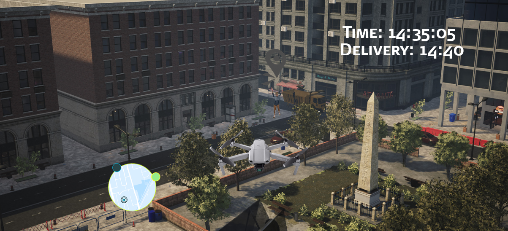

# DELIVR Project
## Concept

  

A delivery company uses drones to deliver small shipments from its business building to their customers. DELIVR is a training VR system for new staff. To better understand the customer experience, the drone operators must switch roles with the end-customers to experience the package delivery and improve it. Safety protocol practices are essential to this project. The drone operators must review and save their scores at the end of the experience. 

A manager will review the scores of the staff after completing the VR training course and will decide if the trainee is capable of operating the drones to real deliveries.

## Scope

### Functional Requirements

- The operator **receives** a new shipment order.
- Operator **starts** the drone program.
- Program has a short tutorial to **understand** the control of the drone.
- Operator **locates** the pickup destination.
- Controls must **simulate** actual drone movement and control.
- The simulation **highlight** the position of the package.
- Operator **picks up** package.
- Operator **locates** the drop off destination.
- The simulation **shows** current time and delivery time.
- The customer **recieves** a notification that the delivery is close.
- The customer **moves** towards a specific location to recieve the package.
- Operator **drops off** the package.
- The operator **confirms** delivery.
- Operator **returns** the drone to central office.

### User Experience

Once the operator enters the simulation in VR, she/he will be in a room similar to the one physically found in real life.  A computer where notifications, deliveries, and emails can be received is in front of the user. Within the work area there are different interactable objects with the objective of creating an immersive and entertaining environment.

The operator receives a notification about a new available delivery, accepts it and begins the flight simulation.

The drone is activated and the interface instructs the operator on how to take off and subsequently test the drone's movement, a process that will serve to train the operator and at the same time verify that the drone works properly.

Once the process aboved explained is complete, a mini map will be added in the interface to guide the operator to the pick up destination. The current time as well as the delivery time will be added to the interface for the operator to calculate the flight time.

